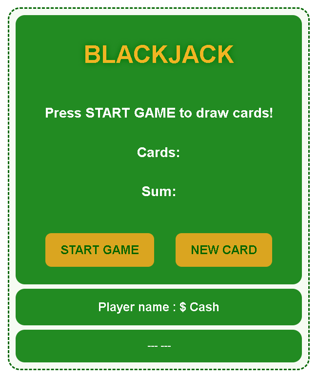

# 🃏 Blackjack Game (JavaScript)

A simple and interactive **Blackjack game** built using **HTML, CSS, and Vanilla JavaScript**.
This project simulates a basic casino-style Blackjack experience with dynamic card generation, score calculation, and game state handling.

---

## 🚀 Live Demo

👉 *not available yet*

---

## 📸 Preview

```

```

---

## 🎯 Features

* 🎲 Random card generation (simulating a real deck)
* 🧮 Automatic sum calculation
* 🧠 Game logic:

  * Win on **Blackjack (21)**
  * Lose if sum exceeds 21
* 🎮 Interactive buttons:

  * Start Game
  * Draw New Card
* 👤 Random player name generator
* 💰 Cash system (Win = $400, Lose = $0, Start = $200)
* 🔄 Game reset and replay functionality
* 🎨 Smooth UI with hover and click effects

---

## 🛠️ Technologies Used

* **HTML5** – Structure
* **CSS3** – Styling & layout (Flexbox, transitions, hover effects)
* **JavaScript (ES6)** – Game logic and DOM manipulation

---

## 🧠 JavaScript Concepts Used

* DOM Manipulation (`getElementById`, `textContent`)
* Event Handling (`onclick`)
* Arrays (`cards`, `players`)
* Loops (`for`)
* Conditional Logic (`if-else`)
* Functions
* Randomization (`Math.random()`)
* State Management

---

## 🎮 How to Play

1. Click **START GAME**
2. Two cards will be drawn automatically
3. If sum is:

   * **21 → You win 🎉**
   * **< 21 → Draw a new card**
   * **> 21 → You lose 💩**
4. Click **NEW CARD** to continue
5. Restart anytime with **START GAME**

---

## ⚡ What I Learned

* Building a complete mini-game from scratch
* Managing game state
* DOM manipulation
* Writing clean and reusable JavaScript functions

---

## 🔮 Future Improvements

* Add dealer logic
* Add betting system
* Use real card visuals
* Add sound effects

---

## 🎓 Learning Source

This project was built as part of my learning journey on **Scrimba**:

👉 [https://scrimba.com/](https://scrimba.com/)

*(Practicing real-world JavaScript projects and improving problem-solving skills.)*

---


## 👨‍💻 Author

**Fakhar Alam**

* 🔗 LinkedIn: [https://www.linkedin.com/in/fakhar-e-alam-a046133b4/](https://www.linkedin.com/in/fakhar-e-alam-a046133b4/)
* 💻 GitHub: [https://github.com/ThisisAlam](https://github.com/ThisisAlam)
* 🎓 Scrimba: [https://scrimba.com/](https://scrimba.com/)

---

## ⭐ Support

If you like this project, give it a ⭐ on GitHub!

---
